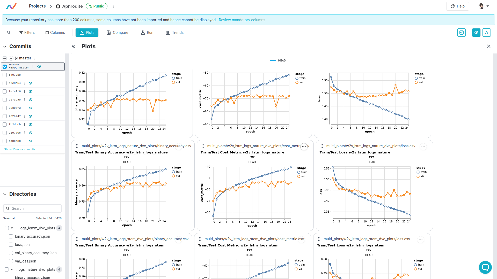

# Aphrodite

Analyse des sentiments (+)(-)(0) sur des tweets : 
Pre- processing des data, NLP, lemmatisation, stemming, Word2Vec, Bert, Glove avec réseaux de neurones type LSTM. 
Programmation du calcul d’une fonction coût orientée métier pour limiter l’impact économique des bad buzz avec TensorFlow.

Rangement des scripts dans le dossier [source](src) ’src’.

Utilisation du software [studio](https://studio.iterative.ai/user/sha-cmd/projects/Aphrodite-1ue5zga6kt). 

